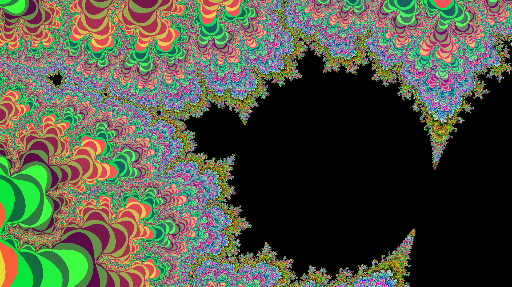
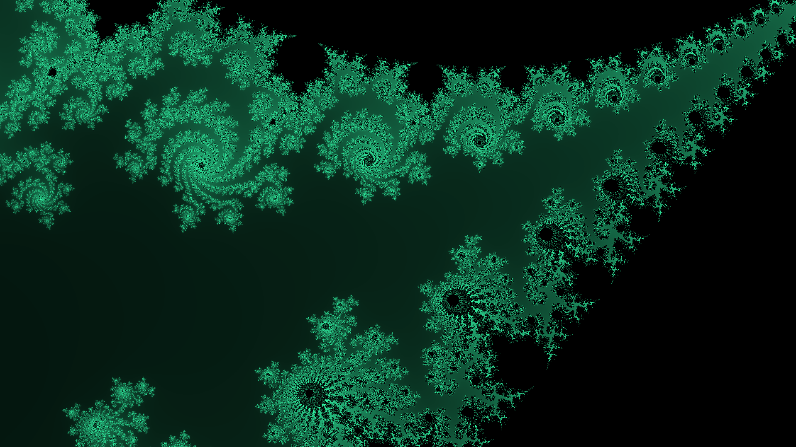
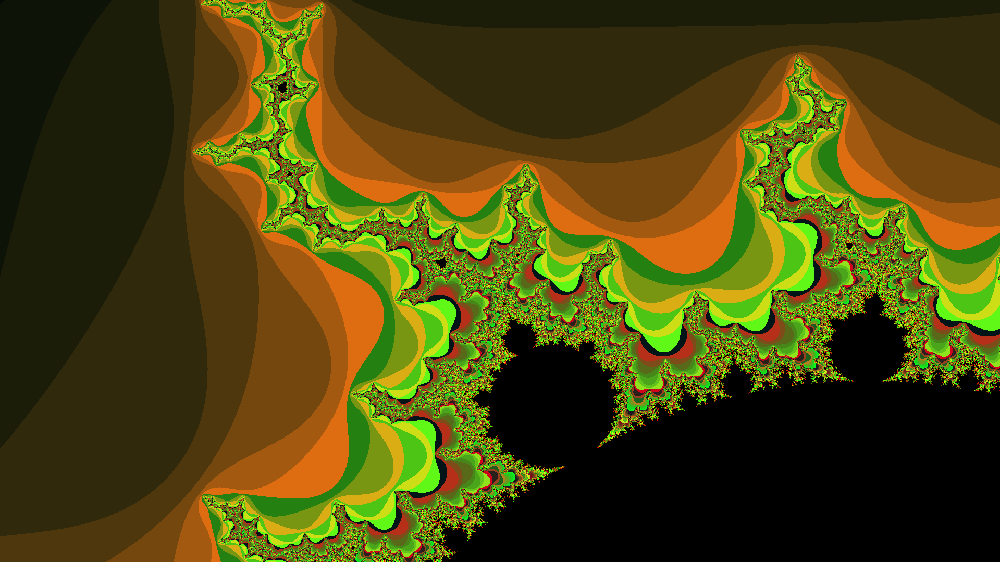

<h1 align="center">🌿 Fractals Project</h1>

## Introduction
Welcome to the Fractals Project! This project explores the fascinating world of fractals, mathematical sets that exhibit a repeating pattern at every scale. Fractals are not only beautiful but also have applications in various fields such as computer graphics, nature modeling, and more. <br><br>
In this project, so far I've implemented only the **Mandelbrot Set**.

## Have a peek!
Here are some screenshots of the fractals generated by this project:






## How it Works
This project takes advantage of a few nifty features. They include:
- **Multithreading**: Fractal Rendering done using standard threads. Achieves a speedup of upto 500%.
- **Color Palettes**: Randomized color palettes are generated each time the program is run. You can also customize this by playing with the `ColorPalette` class.
- **Controls**: Allows user to interact, zoom in/out, move around, and even take a snapshot.


## How to Use:
- So far, we're generating a Mandelbrot Set with a variable number of Iterations and a randomized Color Palette.
- The user can zoom in and out of the fractal by clicking on the desired area. Zoom In = `Left Click`, Zoom Out = `Right Click`.
- You can increase/decrease the number of iterations by scrolling your mouse wheel `Up` or `Down`.
- You can move around the image canvas by pressing your `Up`, `Down`, `Left` or `Right` keys.
- Press `Space` to save the currently rendered fractal to the `imgs` folder as a `.jpg` file.
- To exit, press `Esc`.

## How to Build
To build and run the project, follow these steps:

1. **Clone the repository**:
    ```sh
    git clone https://github.com/AlexJMercer/Fractal-Art.git
    cd Fractal-Art
    ```
    2. **Install dependencies**:
        ```sh
        mkdir build
        cd build
        cmake ..
        mingw32-make        # Since I'm using MinGW compiler
        ```

    3. **Run the application**:
        ```sh
        Fractals.exe
        ```

## What's Next
We have exciting plans for the future of this project, including:
- Adding more fractal algorithms.
- Adding support for GPU rendering (using CUDA).
- Simplifying the color palette generation.

Stay tuned for updates and feel free to contribute!

---

Thank you for checking out the Fractals Project! If you have any questions or suggestions, please open an issue or submit a pull request.
